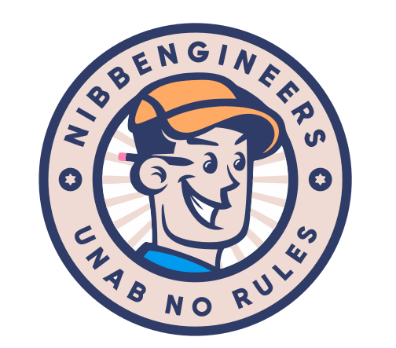

  
  <h1>👽 <b>NibbEngineers</b> 👽</h1>

Welcome to **NibbEngineers** 🚀, an army of three focused on technology, programming, and innovation. Here, we will share all our collaborative projects where we explore new ideas, learn together, and contribute to the world.

## 🤖 **Who We Are**

We are a group of three engineers united to create, learn, and build. Each of us brings expertise and skills in different areas of development, from programming to design and beyond.

- **[Cristian Perez](https://github.com/TostuU)**
- **[Javier Guerra](https://github.com/jwar28)**
- **[Jorge Vergel](https://github.com/jorgev898)**

---

## 🔥 **What We Do**

At **NibbEngineers**, we focus on collaborative projects that allow us to improve our skills and tackle technological challenges together. Each project is an opportunity to learn and grow as a team.

- **Software Projects** 💻
- **AI Research & Development** 🧠
- **Productivity Tools Development** ⚙️

---

## 🚀 **Our Projects**

Here you’ll find repositories where we store the most recent work from **NibbEngineers**. Feel free to explore, contribute, and learn with us.

---

## 📂 **How to Contribute**

We love receiving contributions! If you have an idea or an improvement for our projects, follow these steps:

1. **Fork** the repository.
2. **Create your branch** (`git checkout -b feature/my-new-feature`).
3. **Make your changes** and be sure to test them.
4. **Commit your changes** (`git commit -am 'Added a new feature'`).
5. **Push to your branch** (`git push origin feature/my-new-feature`).
6. Open a **Pull Request** with a clear description of your changes.

---

## ✨ **Why NibbEngineers?**

We believe the best way to learn is by working together. Through our projects, we seek to push the boundaries of technology and make a positive difference. Whether you're here to learn, collaborate, or get inspired, you're in the right place. Join us and let's do great things!
